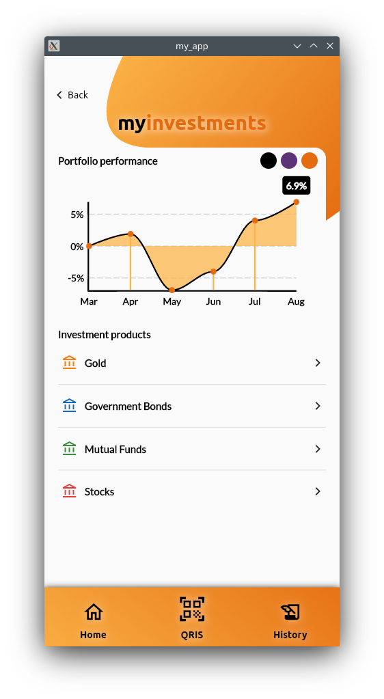
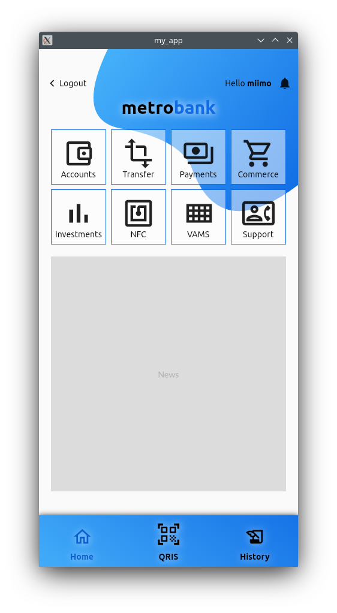
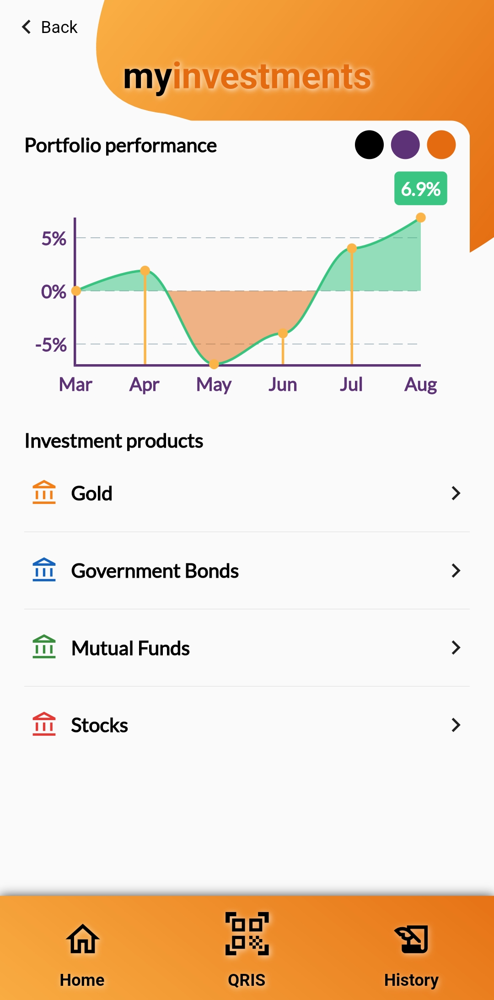
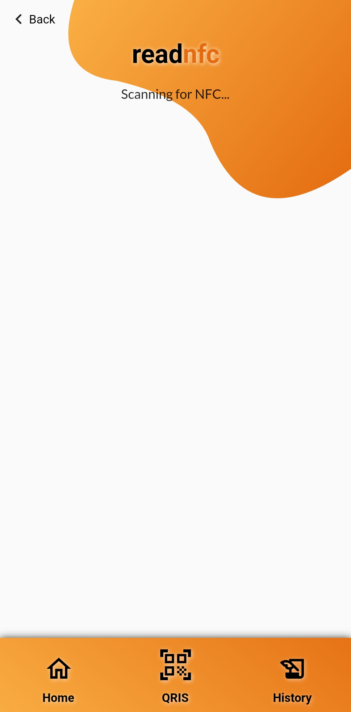

# my_app

My first Flutter project. https://youtu.be/W_Dj-KBIge0

## What does it look like

<table>
    <tr>
        <td></img></td>
        <td></img></td>
        <td></img></td>
        <td></img></td>
        <td></img></td>
        <td></img></td>
    </tr>
    <tr>
        <td></img></td>
        <td></img></td>
        <td></img></td>
        <td></img></td>
        <td></img></td>
        <td></img></td>
    </tr>
</table>

## Available menus

- [Accounts](#accounts--transfer): lists all customer accounts and balance.
- [Transfer](#accounts--transfer): on-us, virtual account, interbank transfer.
- [Payments](#payments--commerce): bill payments, eg. credit cards, internet, utilities, etc.
- [Commerce](#payments--commerce): this menu is used to showcase loading and caching network image with loading spinner and error fallback icon.
- [Investments](#investments): this menu is used to showcase chart.
- [NFC](#nfc-experimental): this menu is used to showcase NFC Scanning capability.
- [Support](#support): telephone call, email, live chat (TODO), and a webview to show a map of company nearest branches.

Quick access (bottom nav bar):
- [Home](#home-main-menu): quick access to go back to main menu.
- [QRIS](#qris-experimental): process QRIS (TODO).
- [History](#history): a shortcut to account statements.

### Accounts & Transfer

<table>
    <tr>
        <td></img></td>
        <td></img></td>
        <td></img></td>
        <td></img></td>
    </tr>
</table>

[Back to top](#available-menus)

### Payments & Commerce

<table>
    <tr>
        <td></img></td>
        <td></img></td>
<td>

https://user-images.githubusercontent.com/2069784/202013739-c8f4c1fc-f567-424d-a93b-c956f8a160f9.mp4

</td>
    </tr>
</table>

[Back to top](#available-menus)

### Investments

This menu showcases chart display and color switches.
<table>
    <tr>
        <td></img></td>
        <td></img></td>
        <td></img></td>
    </tr>
</table>

[Back to top](#available-menus)

### NFC (experimental)

<table>
    <tr>
        <td></img></td>
        <td></img></td>
        <td></img></td>
    </tr>
</table>

[Back to top](#available-menus)

### Support

<table>
    <tr>
        <td></img></td>
        <td></img></td>
        <td></img></td>
    </tr>
</table>

[Back to top](#available-menus)

### Home (main menu)

</img>

[Back to top](#available-menus)

### QRIS (experimental)

<table>
    <tr>
        <td></img></td>
        <td></img></td>
        <td></img></td>
    </tr>
</table>

[Back to top](#available-menus)

### History

This menu will be used as a shortcut (quick access) to account statements.

[Back to top](#available-menus)
